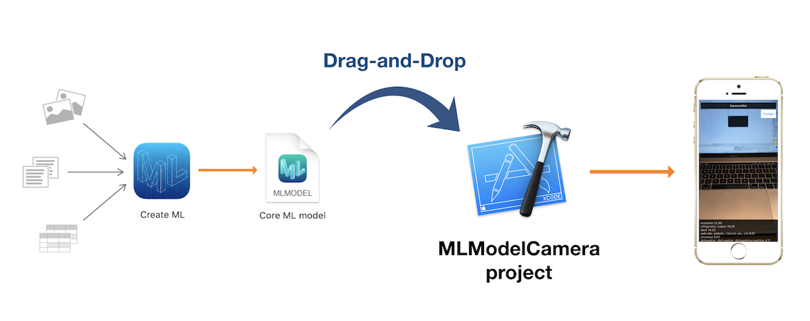

# MLModelCamera

[Create ML](https://developer.apple.com/documentation/create_ml) enable us to train [Core ML](https://developer.apple.com/documentation/coreml) models just with Drag-and-Drop. Then, MLModelCamera enable to test the `.mlmodel` files as a real-time image classiffication app just with Drag-and-Drop.

## Usage

- Put your `.mlmodel` files into the `/models` folder.

That's it! You don't need to add the models manually to the project.

After running the app on your iOS device, you can choose the model with the "Change" button.

## Requirements

### The models are created with Create ML

- Xcode 10+
- iOS 12+

### The models are created with coremltools

- Xcode 9+
- iOS 11+

## How to find trained models

- https://github.com/SwiftBrain/awesome-CoreML-models
- https://github.com/likedan/Awesome-CoreML-Models

## How to find data for training

- https://github.com/awesomedata/awesome-public-datasets
- https://www.kaggle.com/datasets

## Limitations

Currently, it only supports image classification models.

## Author

**Shuichi Tsutsumi**

iOS programmer from Japan.

- PAST WORKS:  [My Profile Summary](https://medium.com/@shu223/my-profile-summary-f14bfc1e7099#.vdh0i7clr)
- PROFILES: [LinkedIn](https://www.linkedin.com/in/shuichi-tsutsumi-525b755b/)
- BLOGS: [English](https://medium.com/@shu223/) / [Japanese](http://d.hatena.ne.jp/shu223/)
- CONTACTS: [Twitter](https://twitter.com/shu223) / [Facebook](https://www.facebook.com/shuichi.tsutsumi)

